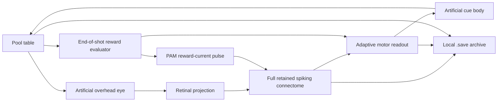

# Fly Brain Billiards

**Can a simulated fly nervous system learn to play pool through a new body and dopamine-like rewards?** This project turns that question into a local, playable experiment.

You play solids. A spiking neural simulation based on the retained **MaleCNS v1.0 connectome** plays stripes through an artificial cue body. It sees an image of the table, produces neural activity, attempts a shot, and receives a reward for useful outcomes. Its neural state and learned parameters can be saved to a `.save` file and resumed later.

The working simulation contains **166,700 neurons and 25,582,938 directed connections**. These are the counts in the graph prepared by the pinned importer, not a claim that every biological process in a fly has been reconstructed. MaleCNS includes central nervous system anatomy; “fly brain” is the project's informal name.

> **Experimental, not a trained pool champion.** Real simulated spikes drive the interface and the learning parameters do change. Improved playing ability has not yet been established by a controlled evaluation. The artificial eye, cue body, motor readout, reward rules and simplified neural dynamics are engineering choices. This project does not demonstrate consciousness, subjective emotions or biological understanding of billiards.

## What you can do

- Play a simplified game of eight-ball against the neural controller in your browser.
- Aim with the mouse, pull back to set shot power, and release to shoot.
- See a long aiming guide and an approximate outgoing direction for the first ball hit. This help is visible to the human only.
- Watch the simulated cue body, its angle, power and accumulated motor spikes.
- Inspect the fly's overhead camera image and retinal views.
- Explore actual neuron soma coordinates, recent spikes, population frequencies, reward pulses and plasticity statistics.
- Save or resume the complete experiment locally, including the table and balls in motion.

The interface currently uses Italian labels; this repository's setup and technical documentation are in English. `biliardo` is Italian for billiards.

## How the loop works



1. **See:** the server renders an overhead image of the actual table. It excludes scores, reward indicators and the human's aiming guide. The neural controller is not handed ball coordinates or a list of correct targets.
2. **Respond:** image luminance and color drive the installed retinal projection. The full retained neural graph is simulated on the GPU using leaky integrate-and-fire dynamics.
3. **Move:** an artificial adaptive readout converts neural activity into a desired cue angle and power. Descending-neuron spikes actuate the cue joints and enable release.
4. **Evaluate:** the authoritative physics engine determines contact, pockets, fouls and turn changes. Only then does it award a scalar reward.
5. **Adapt:** the reward can trigger a bounded artificial current pulse in selected PAM neurons and update the cue readout. Native plasticity updates the model's selected KC→MBON connections while learning is enabled.
6. **Remember:** the application saves the neural state, learned weights, learning traces, random generator state, body and game. A new table preserves the accumulated memory.

There is no language model, cloud inference service, hidden geometric shot planner or human-action imitation in this billiards controller. The experiment does not use the Roblox window-control or optional visual-language-model components of the earlier local project.

## Rewards: why pocketing the right ball matters

The human always owns **solids 1–7**. The fly always owns **stripes 9–15**. The black 8 is a target only after the fly has cleared its own group.

| Fly outcome | Scalar reward | Artificial PAM pulse duration |
| --- | ---: | ---: |
| Correct stripe pocketed on a legal shot | +10 per correct ball | 2,000 neural ms |
| Legal game-winning black 8 | +10 | 2,000 neural ms |
| New useful approach toward a pocket | +2 | 350 neural ms |
| Cue ball first contacts a stripe, with no higher reward | +0.5 | 120 neural ms |
| Wrong first contact, opponent-only pot, cue-ball scratch or illegal black | 0 | No new pulse |

An approach reward requires a legal shot without a pot: an own-group ball must finish less than 65 table units from a pocket and improve by at least 8 units over **both** its starting distance and its previous best. Repeating the same near-pocket position does not repeatedly earn the medium reward.

The small contact reward helps make the feedback less sparse. It is awarded once per shot, even when the correct first contact is followed by no rail or pot; that shot still loses the turn under the foul rule. It is not given for a wrong first ball, an opponent ball pocketed, a scratch or a loss on the black. A legal mixed pot rewards only the fly's own balls; the opponent's balls add nothing. High, medium and contact rewards are alternatives rather than additional bonuses.

**“Dopamine” here means a variable in the simulation.** The reward pulse uses the same finite current amplitude, `dopamine_current = 20`; larger reward categories last longer. It is neither a measured biological dopamine concentration nor evidence that the program feels pleasure. The pulse ends rather than building an unlimited permanent dopamine level. Its duration is in simulated neural time, which can advance at a different rate from wall-clock time.

## What can learn, and what has not been proven

Two mechanisms can adapt:

- **Native circuit plasticity:** the existing model applies its activity-dependent rule to **7,835 selected KC→MBON synapses**. The entire connectivity graph is simulated, but all 25.6 million connections are not freely trainable.
- **Artificial motor learning:** an **88-parameter readout** maps neural features to angle and power. It explores possible actions and uses the outcome to reinforce actions relative to its running reward baseline.

The reward evaluator knows which balls are correct; the visual neural controller has to acquire useful associations through its signals and experience. Giving the evaluator the rules does not mean the controller already understands them. A reward for touching a stripe makes feedback more frequent, but it does not guarantee useful learning.

Weight changes, nonzero rewards and a lucky pocket are not enough to establish progress. The current controller uses coarse visual features and substantial random exploration. It may keep missing or contacting the wrong group. Simply leaving it idle, waiting longer or raising dopamine does not prove it will improve. See [learning details](docs/LEARNING.md) and the [evaluation plan](docs/VALIDATION.md).

## Run locally

The tested configuration is **Windows 11, Python 3.12, an NVIDIA RTX 5080 with 16 GB VRAM, and the pinned CuPy/CUDA 13 environment**. Other GPU/OS combinations have not been validated. The full neural player requires CUDA; there is no CPU fallback for the full graph. CPU-only game and interface tests are provided.

Install Python 3.12 (64-bit), Git and a compatible NVIDIA driver, then run:

```powershell
git clone https://github.com/KakaoXI/fly-brain-billiards.git
cd fly-brain-billiards
py -3.12 scripts/bootstrap.py
.\.venv\Scripts\python.exe -m biliardo.launcher
```

On Windows, `setup.bat` and `start.bat` provide the same setup and launch steps. The browser opens **http://127.0.0.1:8766/**. Setup downloads the pinned upstream sources, Python dependencies and approximately **1.11 GB of raw connectome tables**, then prepares derived graph files. Allow several additional GB for the environment and generated data. The setup does not install or replace the NVIDIA driver.

After setup, the game and learning run locally. The GitHub repository hosts the code and documentation; it does **not** run the GPU simulation on GitHub Pages or on a remote server. The server listens only on localhost.

See [installation and troubleshooting](docs/INSTALL.md) for manual setup, tests and memory migration.

## Persistent memory

`biliardo/saves/latest.save` is the latest autosave. A `.save` is a checksummed ZIP archive containing:

- neural voltages, conductances, adaptation, refractory state and delayed-spike buffers;
- plastic synaptic weights, learning traces and simulated time;
- motor readout weights, the sampled pending action and random-generator state;
- retinal temporal state;
- balls, velocities, turn, fouls, score history and the table's distance records.

The server saves after completed shots, periodically and on an orderly shutdown. **Save memory** makes a named snapshot; **New game** preserves learning. Close the service with Ctrl+C and let it finish. For an important session, explicitly save and wait for confirmation before closing the terminal; a forced termination or power loss can lose progress after the last completed save.

Your local saves are not uploaded automatically. The repository starts a new experiment and does not ship the developer's private session or a purported pretrained expert. Matching model, graph and configuration hashes are required to load an old memory.

## Validation included

- **39 Python and 11 JavaScript tests** cover physics, collisions, legal targets, rewards, memory, neural release conditions, pause/resume timing, HTTP guards, stream cleanup, mouse gestures and trajectory interpolation.
- A recorded full-GPU check observed the PAM population rise from **2.5 to 91.3 Hz** after a reward pulse, verified changes in native plasticity and motor weights, and restored the complete saved state exactly. This is a wiring/serialization check, not a learning benchmark. See the [recorded evidence](evidence/gpu-validation-2026-09-13.json).
- Physics uses fixed **1/240-second simulation steps** in a separate thread. The browser interpolates batched samples and draws independently of neural updates. This does not promise 240 network messages or rendered frames per second.

```powershell
.\.venv\Scripts\python.exe -m unittest discover -s biliardo/tests -v
node --test biliardo/tests/test_input.mjs biliardo/tests/test_mouse.mjs
```

## Repository map

| Path | Purpose |
| --- | --- |
| `biliardo/game.py` | Fixed-step physics, simplified eight-ball rules and rewards |
| `biliardo/body.py` | Artificial neural-to-cue body and motor learning |
| `biliardo/vision.py` | Table image presented to the retina |
| `biliardo/server.py` | Neural loop, physics worker, API and save orchestration |
| `biliardo/storage.py` | Atomic, validated `.save` archives |
| `biliardo/dist/` | Browser game, cue controls and neural observatory |
| `flyblox/brain/` | Reused full-graph neural runtime and plasticity adapter |
| `flyblox/vision/retina.py` | Pixel-to-retinal-current projection |
| `scripts/` | Reproducible setup and verification |
| `config/` | Experiment configuration and pinned source/data hashes |
| `docs/` | Architecture, learning, installation and validation |

The retained `flyblox/control/decoder.py` is part of the original model's source fingerprint; billiards uses `NeuralBody` instead. Unrelated desktop-control, trading and game assets are not included.

## Credits and licensing

The anatomical data comes from the [MaleCNS collaboration / Janelia FlyEM release](https://male-cns.janelia.org/download/), whose download page specifies CC BY licensing. Data and upstream repositories are fetched separately, with attribution and pinned revisions in [THIRD_PARTY.md](THIRD_PARTY.md).

The experiment builds on [Stonkfly](https://github.com/nftechie/stonkfly), with [DOOMFLY](https://github.com/nftechie/doomfly) as a preceding source/reference, and uses the spike-compaction kernel from [FastFly](https://github.com/eonfathom/FastFly). It is an independent project, not an official product or a validated biological model from those teams. No repository-wide license has yet been selected for the original application code; third-party components retain their own terms.
